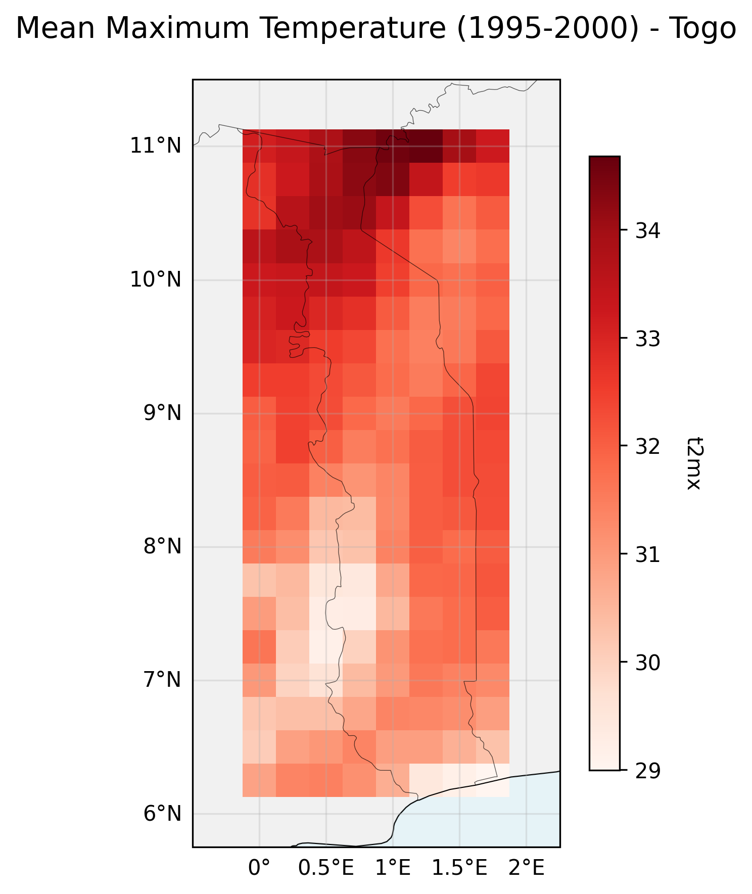
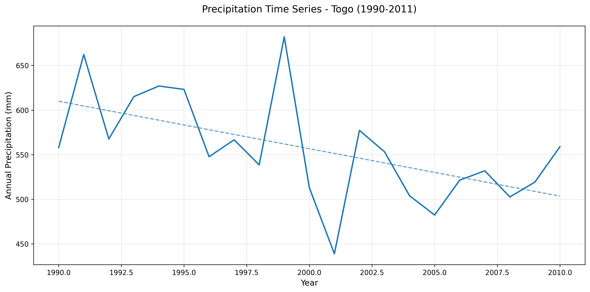

<p align="center">
  
</p>

<p align="center">
  <a href="https://pypi.org/project/cavapy/"></a>
  <a href="https://pepy.tech/project/cavapy"></a>
  
  <a href="https://www.fao.org/contact-us/data-protection-and-privacy/en/"></a>
</p>

<p align="center">
  Retrieve, subset, and process CORDEX-CORE and ERA5 climate data directly from THREDDS/OPeNDAP.
</p>

<p align="center">
  <a href="https://github.com/risk-team/cavapy/stargazers">Star this project on GitHub</a>
</p>

---

## What is cavapy?

`cavapy` is a Python package built for climate-impact workflows where you need reliable data access without handling massive raw NetCDF archives manually.

It is part of the CAVA (Climate and Agriculture Risk Visualization and Assessment) ecosystem and focuses on:

- Fast access to CORDEX-CORE simulations
- Access to ERA5 observations
- Optional bias correction and calendar harmonization
- Clean integration with downstream hydrology, agronomy, and risk-analysis pipelines

Project context: [CAVA overview](https://risk-team.github.io/CAVAanalytics/articles/CAVA.html)

---

## Data Coverage

### Sources

- CORDEX-CORE regional climate simulations (25 km)
- ERA5 reanalysis (used directly and for optional correction workflows)

Data is hosted on the University of Cantabria THREDDS infrastructure within the CAVA initiative (FAO, University of Cantabria, University of Cape Town, Predictia).

### Available datasets

- `CORDEX-CORE`: original model outputs
- `CORDEX-CORE-BC`: pre-bias-corrected outputs using ISIMIP methodology

### Available variables

- `tasmax`: daily maximum temperature (degC)
- `tasmin`: daily minimum temperature (degC)
- `pr`: daily precipitation (mm)
- `hurs`: daily relative humidity (%)
- `sfcWind`: daily wind speed at 2 m (m/s)
- `rsds`: daily solar radiation (W/m2)

### Supported domains and scenario/model options

- Domains: `NAM-22`, `EUR-22`, `AFR-22`, `EAS-22`, `SEA-22`, `WAS-22`, `AUS-22`, `SAM-22`, `CAM-22`
- RCPs: `rcp26`, `rcp85`
- GCMs: `MOHC`, `MPI`, `NCC`
- RCMs: `REMO`, `Reg`

---

## Installation

```bash
conda create -n cavapy "python>=3.11"
conda activate cavapy
pip install cavapy
```

---

## Quick Start

### 1) Pre-bias-corrected projections (recommended)

```python
import cavapy

togo = cavapy.get_climate_data(
    country="Togo",
    variables=["tasmax", "pr"],
    cordex_domain="AFR-22",
    rcp="rcp26",
    gcm="MPI",
    rcm="REMO",
    years_up_to=2030,
    dataset="CORDEX-CORE-BC",
)
```

### 2) Original CORDEX-CORE with on-the-fly bias correction

```python
import cavapy

togo = cavapy.get_climate_data(
    country="Togo",
    variables=["tasmax", "pr"],
    cordex_domain="AFR-22",
    rcp="rcp26",
    gcm="MPI",
    rcm="REMO",
    years_up_to=2030,
    bias_correction=True,
    dataset="CORDEX-CORE",
)
```

### 3) ERA5 observations only

```python
import cavapy

era5 = cavapy.get_climate_data(
    country="Togo",
    variables=["tasmax", "pr"],
    obs=True,
    years_obs=range(1980, 2019),
)
```

---

## Core Workflows

### Projections + historical baseline

```python
import cavapy

data = cavapy.get_climate_data(
    country="Afghanistan",
    variables=["tasmax", "pr"],
    cordex_domain="WAS-22",
    rcp="rcp85",
    gcm="NCC",
    rcm="REMO",
    years_up_to=2030,
    historical=True,
    dataset="CORDEX-CORE-BC",
)
```

### Multiple models and/or RCPs

Pass lists (or `None`) to `rcp`, `gcm`, and `rcm`.

```python
import cavapy

multi = cavapy.get_climate_data(
    country="Togo",
    cordex_domain="AFR-22",
    rcp=["rcp26", "rcp85"],
    gcm=["MPI", "MOHC"],
    rcm=["Reg", "REMO"],
    years_up_to=2030,
    historical=True,
)
```

Return shape for multi-combination requests:

```python
multi[rcp][f"{gcm}-{rcm}"][variable]  # -> xarray.DataArray
```

---

## Processing Pipeline

`get_climate_data()` orchestrates:

- Server-side access and subsetting via OPeNDAP
- Parallel data retrieval
- Unit conversions
- Calendar conversion to Gregorian calendar
- Optional empirical quantile mapping bias correction

### Parallelization behavior

- Single model/scenario combo: parallel across variables
- Multiple combos: parallel across combo-variable tasks, capped globally
- Sequential mode is used when `num_processes <= 1` or only one variable is requested
- Default global cap for multi-combo execution: up to `6` processes
- Inside each process, threaded downloads are used for fetch operations

---

## Plotting

`cavapy` includes built-in plotting helpers:

- `plot_spatial_map()`
- `plot_time_series()`

### Spatial map example

```python
import cavapy

data = cavapy.get_climate_data(country="Togo", obs=True, years_obs=range(1990, 2011))

fig = cavapy.plot_spatial_map(
    data["tasmax"],
    time_period=(2000, 2010),
    title="Mean Max Temperature 2000-2010",
    cmap="Reds",
)
```

<p align="center">
  
</p>

### Time series example

```python
fig = cavapy.plot_time_series(
    data["pr"],
    title="Precipitation Time Series - Togo (1990-2011)",
    trend_line=True,
    ylabel="Annual Precipitation (mm)",
    aggregation="sum",
    figsize=(12, 6),
)
```

<p align="center">
  
</p>

If your primary goal is advanced visualization/reporting, see [CAVAanalytics](https://risk-team.github.io/CAVAanalytics/).

---

## Operational Notes

- Check [GitHub issues](https://github.com/risk-team/cavapy/issues) for data server outages or announcement posts.
- Set `CAVAPY_NO_ANNOUNCEMENTS=1` to disable startup announcements in scripts/production runs.

---

## Citation and License

- License: [MIT](LICENSE)
- Package metadata and build details: [pyproject.toml](pyproject.toml)

