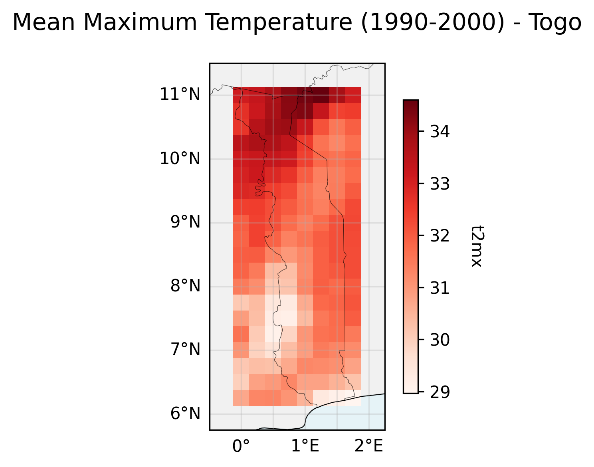

<h1 align="center">cavapy: Access to ERA5 and CORDEX-CORE Datasets Simplified</h1>

<div align="center">
  
  
  
  <a href="https://www.fao.org/contact-us/data-protection-and-privacy/en/" aria-label="FAO Data Protection and Privacy policy">
    
  </a>
  <br><br>
  ⭐ If you like this project, please <a href="https://github.com/risk-team/cavapy/stargazers">give it a star on GitHub</a>!
</div>


--------------------------------------------------------------------------------------------------
⚠️ **Check GitHub issues for known servers' downtimes**

🎉 **NEW: We have released bias-corrected CORDEX-CORE simulations with the ISIMIP methodology for AFR-22, WAS-22, SAM-22, SEA-22 domains!** 🌍 This allows non-expert users to directly use these datasets and avoid the need for custom bias-correction. 📊 Additional domains will be released throughout 2025 and 2026.

--------------------------------------------------------------------------------------------------


## Introduction

`cavapy` is a Python library designed to streamline the retrieval of CORDEX-CORE climate models hosted on THREDDS servers at the University of Cantabria. Using the Open-source Project for a Network Data Access Protocol (**OPeNDAP**), users can directly access and subset datasets without the need to download large NetCDF files. This capability is part of the Climate and Agriculture Risk Visualization and Assessment (CAVA) [project](https://risk-team.github.io/CAVAanalytics/articles/CAVA.html), which focuses on providing high-resolution climate data for scientific, environmental, and agricultural applications.

With `cavapy`, users can efficiently integrate CORDEX-CORE data into their workflows, making it an ideal resource for hydrological and crop modeling, among other climate-sensitive analyses. Additionally, `cavapy` enables bias correction, potentially enhancing the precision and usability of the data for a wide range of applications.


## Data Source

The climate data provided by `cavapy` is hosted on the THREDDS data server of the University of Cantabria as part of the CAVA project. CAVA is a collaborative effort by FAO, the University of Cantabria, the University of Cape Town, and Predictia, aimed at democratising accessibility and usability of climate information.

### Available Datasets via capapy:
- **CORDEX-CORE Simulations**: Dynamically downscaled high-resolution (25 km) climate models, used in the IPCC AR5 report, featuring simulations from:
  - 3 Global Climate Models (GCMs)
  - 2 Regional Climate Models (RCMs)
  - Two Representative Concentration Pathways (RCPs: RCP2.6 and RCP8.5)
- **Reanalyses Dataset**:
  - ERA5 (used for the optional bias correction of the CORDEX-CORE projections)

---

## Available Variables

`cavapy` grants access to critical climate variables, enabling integration into diverse modeling frameworks. The variables currently available include:

- **Daily Maximum Temperature (tasmax)**: °C  
- **Daily Minimum Temperature (tasmin)**: °C  
- **Daily Precipitation (pr)**: mm  
- **Daily Relative Humidity (hurs)**: %  
- **Daily Wind Speed (sfcWind)**: 2 m level, m/s  
- **Daily Solar Radiation (rsds)**: W/m²  

---

## Installation
cavapy can be installed with pip. 

```
conda create -n test "python>=3.11"
conda activate test
pip install cavapy
```

## Process

The get_climate_data function performs automatically:
- Data retrieval in parallel
- Unit conversion
- Convert into a Gregorian calendar (CORDEX-CORE models do not have a full 365 days calendar) through linear interpolation
- Bias correction using the empirical quantile mapping (optional)

### Parallelization strategy
- If you request a single model/RCP combination, cavapy parallelizes **across variables** (one process per variable).
- If you request multiple models and/or RCPs, cavapy parallelizes **across combo-variable tasks** (one process per variable per model), capped globally.
- If `num_processes <= 1` or only one variable is requested, variables run sequentially (even for a single combo).
- By default, up to **12 total processes** are used (capped by number of combo-variable tasks).
- Inside each process, a thread pool handles per-variable downloads and observation/model fetches concurrently.

## Example usage

Depending on the interest, downloading climate data can be done in a few different ways. Note that GCM stands for General Circulation Model while RCM stands for Regional Climate Model. As the climate data comes from the CORDEX-CORE initiative, users can choose between 3 different GCMs downscaled with two RCMs. In total, there are six simulations for any given domain (except for CAS-22 where only three are available).
Since bias-correction requires both the historical run of the CORDEX model and the observational dataset (in this case ERA5), even when the historical argument is set to False, the historical run will be used for learning the bias correction factor.


### Bias-corrected climate projections

**Option 1: Use pre-bias-corrected ISIMIP data (Recommended)**

*Example with AFR-22 domain:*
```
import cavapy
# Get ISIMIP bias-corrected data (no additional bias correction needed)
Togo_climate_data = cavapy.get_climate_data(
    country="Togo", 
    variables=["tasmax", "pr"], 
    cordex_domain="AFR-22", 
    rcp="rcp26", 
    gcm="MPI", 
    rcm="REMO", 
    years_up_to=2030, 
    dataset="CORDEX-CORE-BC"  # Pre-bias-corrected with ISIMIP methodology
)
```

*Example with WAS-22 domain:*
```
import cavapy
# Get ISIMIP bias-corrected data for West Asia
Pakistan_climate_data = cavapy.get_climate_data(
    country="Pakistan", 
    variables=["tasmax", "pr"], 
    cordex_domain="WAS-22", 
    rcp="rcp85", 
    gcm="MPI", 
    rcm="REMO", 
    years_up_to=2030, 
    dataset="CORDEX-CORE-BC"  # Pre-bias-corrected with ISIMIP methodology
)
```

**Option 2: Apply bias correction on-the-fly (Original method)**
```
import cavapy
# Apply empirical quantile mapping bias correction
Togo_climate_data = cavapy.get_climate_data(
    country="Togo", 
    variables=["tasmax", "pr"], 
    cordex_domain="AFR-22", 
    rcp="rcp26", 
    gcm="MPI", 
    rcm="REMO", 
    years_up_to=2030, 
    bias_correction=True, 
    dataset="CORDEX-CORE"  # Original data with on-the-fly bias correction
)
```
### Non bias-corrected climate projections (Original CORDEX-CORE data)

```
import cavapy
# Get original CORDEX-CORE data without any bias correction
Togo_climate_data = cavapy.get_climate_data(
    country="Togo", 
    variables=["tasmax", "pr"], 
    cordex_domain="AFR-22", 
    rcp="rcp26", 
    gcm="MPI", 
    rcm="REMO", 
    years_up_to=2030, 
    dataset="CORDEX-CORE"  # Original data, no bias correction
)
```
### Climate projections plus historical run

This is useful when assessing changes from the historical period. 

**With ISIMIP bias-corrected data:**

*Example with AFR-22 domain:*
```
import cavapy
# Get both historical and projection data (ISIMIP bias-corrected)
Togo_climate_data = cavapy.get_climate_data(
    country="Togo", 
    variables=["tasmax", "pr"], 
    cordex_domain="AFR-22", 
    rcp="rcp26", 
    gcm="MPI", 
    rcm="REMO", 
    years_up_to=2030, 
    historical=True,
    dataset="CORDEX-CORE-BC"  # Pre-bias-corrected data
)
```

*Example with WAS-22 domain:*
```
import cavapy
# Get both historical and projection data for West Asia (ISIMIP bias-corrected)
Afghanistan_climate_data = cavapy.get_climate_data(
    country="Afghanistan", 
    variables=["tasmax", "pr"], 
    cordex_domain="WAS-22", 
    rcp="rcp85", 
    gcm="NCC", 
    rcm="REMO", 
    years_up_to=2030, 
    historical=True,
    dataset="CORDEX-CORE-BC"  # Pre-bias-corrected data
)
```

**With on-the-fly bias correction:**
```
import cavapy
# Apply bias correction to both historical and projection data
Togo_climate_data = cavapy.get_climate_data(
    country="Togo", 
    variables=["tasmax", "pr"], 
    cordex_domain="AFR-22", 
    rcp="rcp26", 
    gcm="MPI", 
    rcm="REMO", 
    years_up_to=2030, 
    bias_correction=True, 
    historical=True,
    dataset="CORDEX-CORE"
)
```
### Observations only (ERA5)

```
import cavapy
Togo_climate_data = cavapy.get_climate_data(country="Togo", variables=["tasmax", "pr"], obs=True,  years_obs=range(1980,2019))
```

### Multiple models and/or RCPs

You can pass lists (or None) to `rcp`, `gcm`, and `rcm`. If multiple combinations are requested,
the return structure becomes nested:

```
results[rcp][f"{gcm}-{rcm}"][variable] -> DataArray
```

Example: all models and both RCPs for Togo (AFR-22):
```
import cavapy

data = cavapy.get_climate_data(
    country="Togo",
    cordex_domain="AFR-22",
    rcp=None,          # all RCPs
    gcm=None,          # all GCMs
    rcm=None,          # all RCMs
    years_up_to=2030,
    historical=True,
    dataset="CORDEX-CORE",
)
```

Example: specific models and RCPs:
```
data = cavapy.get_climate_data(
    country="Togo",
    cordex_domain="AFR-22",
    rcp=["rcp26", "rcp85"],
    gcm=["MPI", "MOHC"],
    rcm=["Reg", "REMO"],
    years_up_to=2030,
    historical=True,
)
```

## Plotting Functionality

`cavapy` now includes built-in plotting functions to easily visualize your climate data as maps and time series. The plotting functions work seamlessly with the data returned by `get_climate_data()`. **However, if your main goal is visualisation, we strongly encourage you to check out [CAVAanalytics](https://risk-team.github.io/CAVAanalytics/), our R package**.

### Available Plotting Functions

- **`plot_spatial_map()`**: Create spatial maps of climate variables
- **`plot_time_series()`**: Generate time series plots with trend analysis

### Plotting Examples

#### Spatial Maps
```python
import cavapy

# Get climate data
data = cavapy.get_climate_data(country="Togo", obs=True, years_obs=range(1990, 2011))

# Plot mean temperature map for a specific period
fig = cavapy.plot_spatial_map(
    data['tasmax'], 
    time_period=(2000, 2010),
    title="Mean Max Temperature 2000-2010",
    cmap="Reds"
)
```

<div align="center">
  
  <br><em>Example spatial map showing mean maximum temperature in Togo (2000-2010)</em>
</div>

#### Time Series Analysis
```python
# Plot precipitation time series with trend analysis
fig_precip = cavapy.plot_time_series(
    data['pr'],
    title="Precipitation Time Series - Togo (1990-2000)",
    trend_line=True,
    ylabel="Annual Precipitation (mm)",
    aggregation="sum",
    figsize=(12, 6)
)
```

<div align="center">
  
  <br><em>Example time series plot showing precipitation trends in Togo (1990-2011) with trend line</em>
</div>


